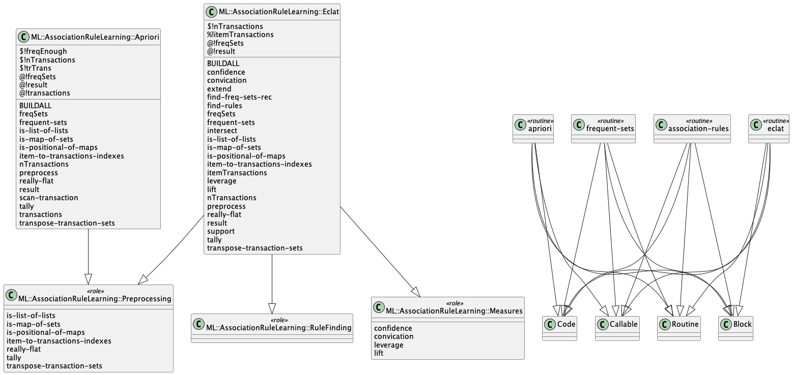

# Raku ML::AssociationRuleLearning

Raku package for association rule learning.

This repository has the code of a Raku package for
[Association Rule Learning (ARL)](https://en.wikipedia.org/wiki/Association_rule_learning)
functions, [Wk1].

ARL framework includes the algorithms 
[Apriori](https://en.wikipedia.org/wiki/Apriori_algorithm) 
and 
[Eclat](https://en.wikipedia.org/wiki/Association_rule_learning#Eclat_algorithm), 
and the measures 
[confidence](https://en.wikipedia.org/wiki/Association_rule_learning#Confidence),
[lift](https://en.wikipedia.org/wiki/Association_rule_learning#Lift), and 
[conviction](https://en.wikipedia.org/wiki/Association_rule_learning#Conviction).

For computational introduction to ARL utilization (in Mathematica) see the article
["Movie genre associations"](https://mathematicaforprediction.wordpress.com/2013/10/06/movie-genre-associations/),
[AA1].

The examples below use the packages
["Data::Generators"](https://raku.land/cpan:ANTONOV/Data::Generators),
["Data::Reshapers"](https://raku.land/cpan:ANTONOV/Data::Reshapers), and
["Data::Summarizers"](https://raku.land/cpan:ANTONOV/Data::Summarizers), described in the article
["Introduction to data wrangling with Raku"](https://rakuforprediction.wordpress.com/2021/12/31/introduction-to-data-wrangling-with-raku/),
[AA2].

-------

## Installation

Via zef-ecosystem:

```shell
zef install ML::AssociationRuleLearning
```

From GitHub:

```shell
zef install https://github.com/antononcube/Raku-ML-AssociationRuleLearning
```

-------

## Frequent sets finding 

Here we get the Titanic dataset (from "Data::Reshapers") and summarize it:

```perl6
use Data::Reshapers;
use Data::Summarizers;
my @dsTitanic = get-titanic-dataset();
records-summary(@dsTitanic);
```
```
# +---------------+-----------------+-------------------+----------------+----------------+
# | passengerSex  | id              | passengerSurvival | passengerClass | passengerAge   |
# +---------------+-----------------+-------------------+----------------+----------------+
# | male   => 843 | 621     => 1    | died     => 809   | 3rd => 709     | 20      => 334 |
# | female => 466 | 628     => 1    | survived => 500   | 1st => 323     | -1      => 263 |
# |               | 524     => 1    |                   | 2nd => 277     | 30      => 258 |
# |               | 54      => 1    |                   |                | 40      => 190 |
# |               | 1026    => 1    |                   |                | 50      => 88  |
# |               | 362     => 1    |                   |                | 60      => 57  |
# |               | 678     => 1    |                   |                | 0       => 56  |
# |               | (Other) => 1302 |                   |                | (Other) => 63  |
# +---------------+-----------------+-------------------+----------------+----------------+
```

**Problem:** Find all combinations values of the variables "passengerAge", "passengerClass", "passengerSex", and
"passengerSurvival" that appear more 200 times in the Titanic dataset.

Here is how we use Eclat's implementation to give an answer:

```perl6
use ML::AssociationRuleLearning;
my @freqSets = eclat(@dsTitanic, min-support => 200, min-number-of-items => 2, max-number-of-items => Inf):counts;
@freqSets.elems
```
```
# 11
```

The function `eclat` returns the frequent sets together with their support.

Here we tabulate the result:

```perl6
say to-pretty-table(@freqSets.map({ %( Frequent-set => $_.key.join(' '), Support => $_.value) }), align => 'l');
```
```
# +----------+-------------------------------------------------------------+
# | Support  | Frequent-set                                                |
# +----------+-------------------------------------------------------------+
# | 0.158900 | passengerAge:-1 passengerClass:3rd                          |
# | 0.157372 | passengerAge:20 passengerClass:3rd                          |
# | 0.158136 | passengerAge:20 passengerSex:male                           |
# | 0.158136 | passengerAge:20 passengerSurvival:died                      |
# | 0.152788 | passengerClass:1st passengerSurvival:survived               |
# | 0.165011 | passengerClass:3rd passengerSex:female                      |
# | 0.376623 | passengerClass:3rd passengerSex:male                        |
# | 0.319328 | passengerClass:3rd passengerSex:male passengerSurvival:died |
# | 0.403361 | passengerClass:3rd passengerSurvival:died                   |
# | 0.258976 | passengerSex:female passengerSurvival:survived              |
# | 0.521008 | passengerSex:male passengerSurvival:died                    |
# +----------+-------------------------------------------------------------+
```

We can verify the result by looking into these group counts, [AA2]:

```perl6
my $obj = group-by( @dsTitanic, <passengerClass passengerSex>);
.say for $obj>>.elems.grep({ $_.value >= 200 });
$obj = group-by( @dsTitanic, <passengerClass passengerSurvival passengerSex>);
.say for $obj>>.elems.grep({ $_.value >= 200 });
```
```
# 3rd.female => 216
# 3rd.male => 493
# 3rd.died.male => 418
```

**Remark:** For datasets -- i.e. arrays of hashes -- `eclat` preprocess the data by concatenating
column names with corresponding column values. This done in order to prevent "collisions" from of same values from
different columns. If that concatenation is not desired manual preprocessing like this can be used:

```perl6
@dsTitanic.map({ $_.values.List }).Array
```
```
# [(1st female 1 30 survived) (survived 2 male 0 1st) (female 1st 3 died 0) (1st died male 30 4) (1st died 5 female 20) (survived 50 6 1st male) (7 60 female 1st survived) (40 1st 8 male died) (1st female survived 50 9) (10 1st 70 died male) (male 11 1st died 50) (female survived 20 1st 12) (female 20 survived 13 1st) (survived 1st 14 30 female) (survived 15 male 80 1st) (died 16 -1 1st male) (17 20 1st died male) (female 18 50 1st survived) (1st survived female 19 30) (40 1st died 20 male) (40 male survived 21 1st) (survived 1st 22 female 50) (23 1st survived 30 male) (40 24 1st female survived) (30 female 25 survived 1st) (1st male 26 died 20) (survived 20 27 1st male) (survived 28 20 female 1st) (1st female 29 40 survived) (survived 30 30 male 1st) (40 1st 31 died male) (32 1st 40 survived male) (30 survived female 33 1st) (survived 1st 60 female 34) (35 male died 1st 40) (survived female 1st 40 36) (37 survived 1st 20 female) (male 38 survived -1 1st) (male 1st 40 died 39) (1st died 50 40 male) (41 male -1 died 1st) (42 40 female survived 1st) (60 43 female 1st survived) (female survived 60 44 1st) (1st 40 female 45 survived) (46 male 1st died 40) (died 47 -1 1st male) (48 survived 1st male 40) (survived female 49 1st 50) (40 50 survived male 1st) (1st 51 60 survived female) (male 30 52 1st died) (died 1st 30 male 53) (1st 20 died 54 male) (survived male 10 55 1st) (survived female 56 10 1st) (1st male 57 40 survived) (40 58 survived female 1st) (59 died 1st 50 male) (female survived 60 -1 1st) (1st 40 male died 61) (1st 80 female survived 62) (male 1st 63 died 50) (survived female 50 1st 64) (65 survived male 30 1st) (30 survived female 66 1st) (40 67 1st female survived) (female survived 30 68 1st) (40 69 survived male 1st) (-1 female 1st 70 survived) (-1 died 1st 71 male) (72 1st 30 male died) (female 73 survived 30 1st) (1st 74 20 survived female) (male -1 75 1st died) (76 died 1st male 50) (77 1st female 40 survived) (died 40 male 1st 78) (female 1st survived 60 79) (80 60 1st female survived) (-1 1st died 81 male) (1st died 70 82 male) (1st female 40 83 survived) (survived female 1st 84 60) (85 male 40 died 1st) (86 female 40 survived 1st) (50 87 survived 1st male) (survived male 88 1st 30) (1st 89 female survived 30) (male 90 30 died 1st) (survived female 30 91 1st) (1st male survived 30 92) (survived female 20 93 1st) (1st survived male 94 50) (0 male 1st survived 95) (female 96 1st survived 50) (97 died 1st male 50) (98 1st female survived 30) (50 1st survived 99 female) (survived female 100 1st 50) ...]
```

**Remark:** `elcat`'s argument `min-support` can take both integers greater than 1 and frequencies between 0 and 1.
(If an integer greater than one is given, then the corresponding frequency is derived.)

-------

## Association rules finding

Here we find association rules with min support 0.3 and min confidence 0.7:

```perl6
association-rules(@dsTitanic, min-support => 0.3, min-confidence => 0.7)
==> to-pretty-table
```
```
# +------------+----------+----------+----------+-------------------------------------------+------------+-------+------------------------+
# | confidence |   lift   | support  | leverage |                antecendent                | conviction | count |       consequent       |
# +------------+----------+----------+----------+-------------------------------------------+------------+-------+------------------------+
# |  0.809015  | 1.309025 | 0.521008 | 0.122996 |             passengerSex:male             |  2.000009  |  682  | passengerSurvival:died |
# |  0.843016  | 1.309025 | 0.521008 | 0.122996 |           passengerSurvival:died          |  2.267729  |  682  |   passengerSex:male    |
# |  0.847870  | 1.371894 | 0.319328 | 0.086564 |    passengerClass:3rd passengerSex:male   |  2.510823  |  418  | passengerSurvival:died |
# |  0.791667  | 1.229290 | 0.319328 | 0.059562 | passengerClass:3rd passengerSurvival:died |  1.708785  |  418  |   passengerSex:male    |
# |  0.744711  | 1.204977 | 0.403361 | 0.068615 |             passengerClass:3rd            |  1.496229  |  528  | passengerSurvival:died |
# +------------+----------+----------+----------+-------------------------------------------+------------+-------+------------------------+
```

### Reusing found frequent sets

The function `eclat` takes the adverb ":object" that makes `eclat` return an object of type
`ML::AssociationRuleLearning::Eclat`, which can be "pipelined" to find association rules.

Here we find frequent sets, return the corresponding object, and retrieve the result:

```perl6
my $eclatObj = eclat(@dsTitanic.map({ $_.values.List }).Array, min-support => 0.12, min-number-of-items => 2, max-number-of-items => 6):object;
$eclatObj.result.elems
```
```
# 23
```

Here we find association rules and pretty-print them:

```perl6
$eclatObj.find-rules(min-confidence=>0.7)
==> to-pretty-table 
```
```
# +------------+-------+------------+----------+----------+-------------+------------+----------+
# | consequent | count | confidence | support  | leverage | antecendent | conviction |   lift   |
# +------------+-------+------------+----------+----------+-------------+------------+----------+
# |  survived  |  339  |  0.727468  | 0.258976 | 0.122996 |    female   |  2.267729  | 1.904511 |
# |    male    |  185  |  0.703422  | 0.141329 | 0.011938 |      -1     |  1.200349  | 1.092265 |
# |    male    |  682  |  0.843016  | 0.521008 | 0.122996 |     died    |  2.267729  | 1.309025 |
# |    died    |  682  |  0.809015  | 0.521008 | 0.122996 |     male    |  2.000009  | 1.309025 |
# |    male    |  159  |  0.836842  | 0.121467 | 0.027990 |   -1 died   |  2.181917  | 1.299438 |
# |    died    |  159  |  0.859459  | 0.121467 | 0.034121 |   -1 male   |  2.717870  | 1.390646 |
# |    male    |  418  |  0.791667  | 0.319328 | 0.059562 |   3rd died  |  1.708785  | 1.229290 |
# |    died    |  418  |  0.847870  | 0.319328 | 0.086564 |   3rd male  |  2.510823  | 1.371894 |
# |    male    |  176  |  0.846154  | 0.134454 | 0.032122 |   20 died   |  2.313980  | 1.313897 |
# |    died    |  176  |  0.846154  | 0.134454 | 0.036249 |   20 male   |  2.482811  | 1.369117 |
# |    3rd     |  208  |  0.790875  | 0.158900 | 0.050076 |      -1     |  2.191819  | 1.460162 |
# |    died    |  190  |  0.722433  | 0.145149 | 0.020977 |      -1     |  1.376142  | 1.168931 |
# |    died    |  528  |  0.744711  | 0.403361 | 0.068615 |     3rd     |  1.496229  | 1.204977 |
# |    died    |  158  |  0.759615  | 0.120703 | 0.022498 |    -1 3rd   |  1.588999  | 1.229093 |
# |    3rd     |  158  |  0.831579  | 0.120703 | 0.042085 |   -1 died   |  2.721543  | 1.535313 |
# +------------+-------+------------+----------+----------+-------------+------------+----------+
```

**Remark:** Note that because of the specified min confidence, the number of association rules is "contained" --
a (much) larger number of rules would be produced with, say, `min-confidence=>0.2`.


-------

## Implementation considerations

### UML diagram

Here is an UML diagram that shows package's structure:




The
[PlantUML spec](./resources/class-diagram.puml)
and
[diagram](./resources/class-diagram.png)
were obtained with the CLI script `to-uml-spec` of the package "UML::Translators", [AAp6].

Here we get the [PlantUML spec](./resources/class-diagram.puml):

```shell
to-uml-spec ML::AssociationRuleLearning > ./resources/class-diagram.puml
```

Here get the [diagram](./resources/class-diagram.png):

```shell
to-uml-spec ML::AssociationRuleLearning | java -jar ~/PlantUML/plantuml-1.2022.5.jar -pipe > ./resources/class-diagram.png
```

### Eclat

Eclat is based on Raku's 
[sets, bags, and mixes](https://docs.raku.org/language/setbagmix)
functionalities.

Eclat represents the transactions as a hash of sets:

- The keys of the hash are items

- The elements of the sets are transaction identifiers.

(In other words, for each item and inverse index is made.)

This representation allows for quick calculation of item combinations support.

We can say the Eclat uses a "vertical database representation" of the transactions.

### Apriori 

Apriori uses the standard, horizontal database transactions representation.

We can say that Apriori:

- Generates candidates for item frequent sets using the routine 
  [`combinations`](https://docs.raku.org/routine/combinations)

- Filters candidates by 
  [Tries with frequencies](https://github.com/antononcube/Raku-ML-TriesWithFrequencies) 
  creation and removal by threshold

Apriori is usually (much) slower than Eclat. 
Historically, Apriori is the first ARL method, and its implementation in the package is didactic.

### Association rules

We can say that the association rule finding function is a general, but that function
does require fast computation of confidence, lift, etc. Hence Eclat's transactions representation
is used.

Association rules finding with Apriori is the same as with Eclat. 
The package function `assocition-rules` with `method=>'Apriori`
simply sends Apriori found frequent sets to the Eclat based association rule finding.

-------

## References

### Articles

[Wk1] Wikipedia entry, ["Association Rule Learning"](https://en.wikipedia.org/wiki/Association_rule_learning).

[AA1] Anton Antonov,
["Movie genre associations"](https://mathematicaforprediction.wordpress.com/2013/10/06/movie-genre-associations/),
(2013),
[MathematicaForPrediction at WordPress](https://mathematicaforprediction.wordpress.com).

[AA2] Anton Antonov,
["Introduction to data wrangling with Raku"](https://rakuforprediction.wordpress.com/2021/12/31/introduction-to-data-wrangling-with-raku/),
(2021),
[RakuForPrediction at WordPress](https://rakuforprediction.wordpress.com).

### Packages

[AAp1] Anton Antonov,
[Implementation of the Apriori algorithm in Mathematica](https://github.com/antononcube/MathematicaForPrediction/blob/master/AprioriAlgorithm.m),
(2014-2016),
[MathematicaForPrediction at GitHub/antononcube](https://github.com/antononcube/MathematicaForPrediction/).

[AAp2] Anton Antonov,
[Implementation of the Eclat algorithm in Mathematica](https://github.com/antononcube/MathematicaForPrediction/blob/master/EclatAlgorithm.m),
(2022),
[MathematicaForPrediction at GitHub/antononcube](https://github.com/antononcube/MathematicaForPrediction/).

[AAp3] Anton Antonov,
[Data::Generators Raku package](https://github.com/antononcube/Raku-Data-Generators),
(2021),
[GitHub/antononcube](https://github.com/antononcube).

[AAp4] Anton Antonov,
[Data::Reshapers Raku package](https://github.com/antononcube/Raku-Data-Reshapers),
(2021),
[GitHub/antononcube](https://github.com/antononcube).

[AAp5] Anton Antonov,
[Data::Summarizers Raku package](https://github.com/antononcube/Raku-Data-Summarizers),
(2021),
[GitHub/antononcube](https://github.com/antononcube).

[AAp6] Anton Antonov,
[UML::Translators Raku package](https://github.com/antononcube/Raku-UML-Translators),
(2022),
[GitHub/antononcube](https://github.com/antononcube).


